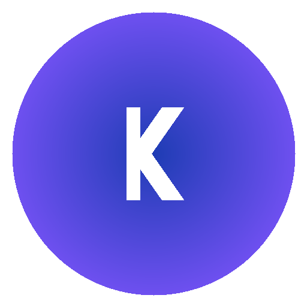
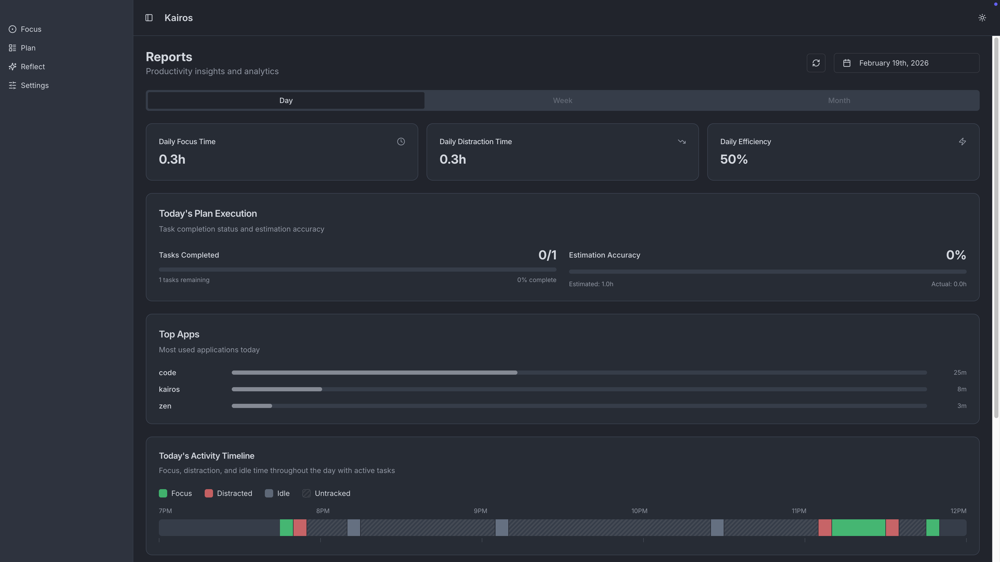
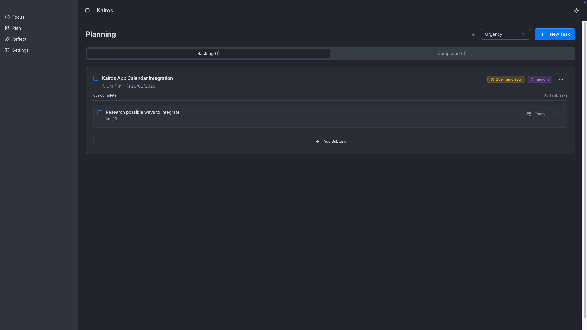
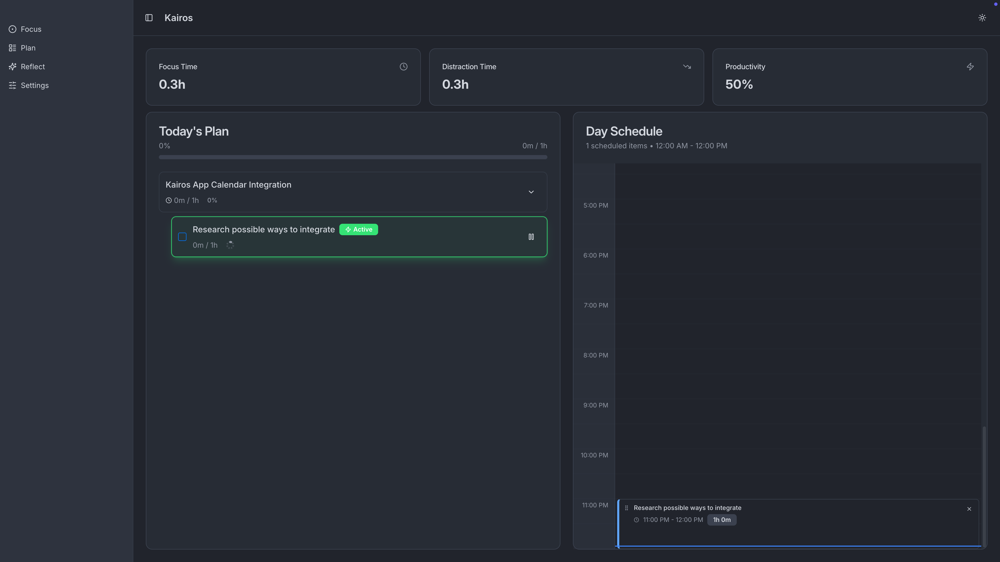

<p align="center">
  
</p>

<h1 align="center">Kairos</h1>

A desktop productivity app for task management, day planning, and focus tracking. Built with Electron, React, and Bun.

Kairos integrates with [ActivityWatch](https://activitywatch.net/) to automatically track your focus and distraction time, giving you real insights into how you spend your day.

<p align="center">
  
</p>

## Features

- **Focus** — See today's productivity metrics at a glance, manage your daily task list, and view scheduled work on a full-day timeline with a live current-time indicator
- **Plan** — Organize tasks and subtasks, set priorities and due dates, estimate time, and drag subtasks onto your day schedule
- **Reflect** — Review daily and monthly reports with breakdowns of focus time, distraction time, and productivity trends
- **ActivityWatch Integration** — Automatic focus/distraction classification based on your actual app usage
- **Offline & Local** — All data stays on your machine in a local SQLite database

## Screenshots

<details>
<summary>Plan</summary>



</details>

<details>
<summary>Focus</summary>



</details>

## Installation

Download the latest release for your platform from the [Releases](https://github.com/Zidan241/Kairos/releases) page.

| Platform | Format |
|----------|--------|
| macOS    | `.zip` |
| Windows  | `.exe` (Squirrel installer) |

### Prerequisites for Focus Tracking

Install [ActivityWatch](https://activitywatch.net/) and make sure `aw-server` is running. Kairos will automatically connect to it and start collecting productivity data.

## Development

### Requirements

- [Bun](https://bun.sh/) (v1.0+)
- [Node.js](https://nodejs.org/) (v20+)

### Setup

```bash
# Clone the repo
git clone https://github.com/Zidan241/Kairos.git
cd Kairos

# Install dependencies
bun install

# Start development (server + client with hot reload)
bun run dev
```

## Tech Stack

- **Desktop**: Electron + Electron Forge
- **Frontend**: React, Tailwind CSS, shadcn/ui, Recharts
- **Backend**: Bun, Express, Drizzle ORM, SQLite
- **ActivityWatch**: HTTP client for focus/distraction tracking

## License

[MIT](LICENSE)
